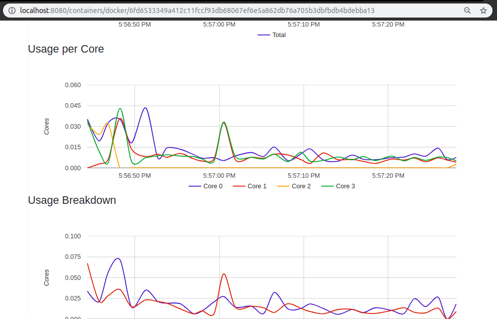

# Admin Module
A webapp and python implementation where the python implementation is responsible for monitoring and storing the resource Data of the containers and server. The webapp part is responsible for creating useful graphs out of it for the admin to gain useful insights, this webapp is also responsible for listing the Docker Images on the Server and provide an interface to modify these images.


## Instruction

run 
```sh
$ docker load < cadvisor.tar
```

This command will import the image to your docker daemon. 

now run
```sh
$ docker run \
--volume=/:/rootfs:ro \
--volume=/var/run:/var/run:rw \
--volume=/sys:/sys:ro \
--volume=/var/lib/docker/:/var/lib/docker:ro \
--publish=8080:8080 \
--detach=true \
--name=cadvisor \
google/cadvisor:latest
```

This will run the admin module and can be accessed by [http://localhost:8080](http://localhost:8080)

### Look of the module



The image shown above is for one container. Admin can take a look at each of the containers to see which container is giving of the maximum load.

## Team Members:
- Hrishikesh Sagar B16029
- Hrushikesh Sarode B16032
- Sammarth Kapse B16031
- Vinayak Kuthial B16039
