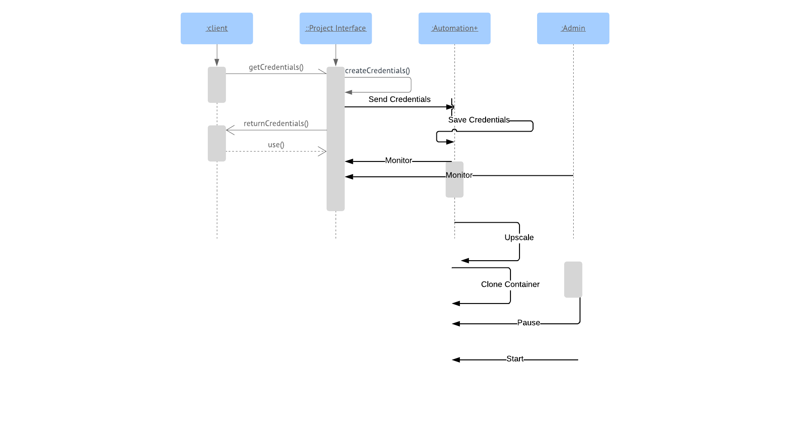

# Docker Hosting Projects using Shared Containers

Several Projects made by students needs to be hosted at a server providing efficient consumption
of host resources. These student projects are heterogeneous in terms of the software components
required. However, there may be certain software components that are common to a group of
projects. Rather than create a docker container for each project, we want to create shared
containers for shared components across projects. Sharing containers is not always a good idea.
If one of the projects that shares a container has a heavy load, it will affect others as well. Hence,
we need mechanism to monitor application level requests and isolate the application from others
in case its requests increase beyond a threshold. We can create a new container for that project
with a cap on the resource usage.

## Design Overview
For hosting various projects, docker images and containers will be used. Operating System used
is Ubuntu 16.04 SERVER. The server will run docker daemon on itself(and act as a host for
docker), all the containers and images will be manged on this docker daemon only. Each project
will be given a username and a password and storage space. The project interface module, the
automation module and the admin module will run on the same server. To know more about
these modules refer below to Architecture

## Intended Audience

The members of programming club are the immediate audience of this software. This software
will help the Coordiantors to monitor, handle and allocate server resources easily and
automatically. Students who will be using this software can work without worrying about
resource allocation and isolation

## References.

[1] “Top Docker Monitoring Tools”, Code Maze accessed on 29/04/2019, 
https://code-maze.com/top-docker-monitoring-tools/
[2] “A Full Hardware Guide to Deep Learning”, Tim Dettmers accessed on 29/04/2019,
https://timdettmers.com/2018/12/16/deep-learning-hardware-guide/

# Detailed Design

## Architecture
The server will be used for storing of all data, any appliation that needs to save data to any
particular location or needs to create configs file at a location then those folders will be linked to
mounted volumes from the server.
Mounted Volumes: Docker provides a cli to mount folder present on the host machine to a
particular location on the containers.

Figure 1: Block diagram for working of the components.

### WorkFlow

Figure 2: Flow of control and processing in my platform.

##Components

### The Project interface Module:
A webapp implementation that takes in software requirements of the user, decides an appropriate
Docker Image for the project, create a container for the same, creates a user onto it (we create
users for different projects to isolate shared resources on the container) and sends back the
respective usernames and passwords

### The Automation Module:
A python implementation to monitor the resources used, available resources. Using various
parameters it will decide on a threshold to set a limit after which a service will be scaled up or
down. It will be this piece of software responsible to clone the container and ensure data security
during this cloning(preferably pause the container)

### The Admin Module:
a webapp and python implementation where the python implementation is responsible for
monitoring and storing the resource Data of the containers and server. The webapp part is
responsible for creating useful graphs out of it for the admin to gain useful insights, this webapp
is also responsible for listing the Docker Images on the Server and provide an interface to modify
these images.

### External Components

- Cadvisor: A containerized tool to monitor the resources used by the containers and total resources used.
- Docker Swarm: Can be used for scaling up and down of the number of containers dynamically for load balancing.
- Docker Images: Images of Apache Server, NodeJS app, MongoDB, MySQL.
- Port Forwarding: Port forwarding is needed in order to map tdifferent apps to different containers.
- JMeter: To test stress the load onto the websites hosted on the VM containers.
- Flask: To develop web-apps for project interface module and admin module.
