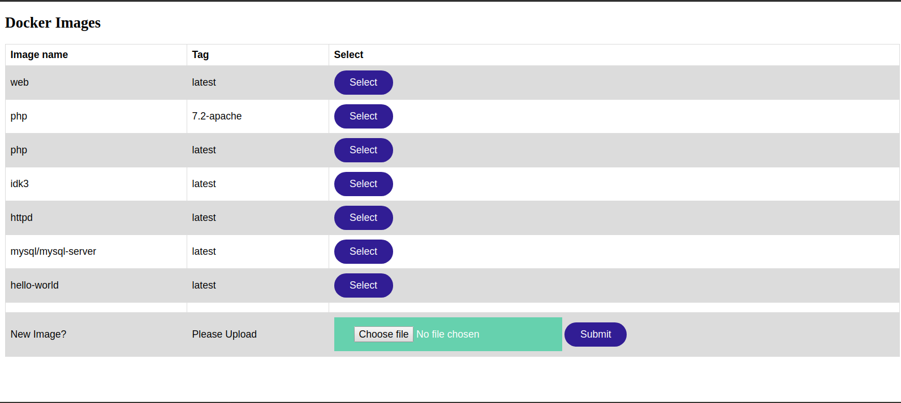
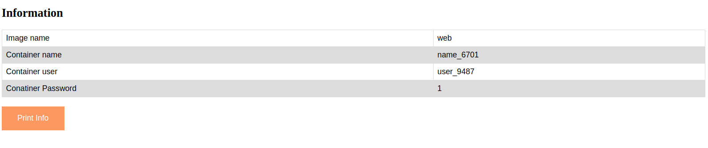

# Project Interface Module
A webapp and python implementation where the python implementation is responsible for monitoring and storing the resource Data of the containers and server. The webapp part is responsible for creating useful graphs out of it for the admin to gain useful insights, this webapp is also responsible for listing the Docker Images on the Server and provide an interface to modify
these images.

## Requirements
- Python 3
- Flask
- numpy

## Initiate Webapp
change directory to webapp
run the ``main.py`` file by following command.
```sh
 $ python3 main.py
 ```
The link forwebapp will be printed on the terminal, following that link in the web browser will open the interface.

## Use
Opening the link given by ``main.py`` will open this page.



This is the main page where all the available Docker Images are listed. Select one of them by ``Select`` button will open next page.



Pressing select button creates container of that image, name and other information is displayed by this information.


## Team Members:
- Hrishikesh Sagar B16029
- Hrushikesh Sarode B16032
- Sammarth Kapse B16031
- Vinayak Kuthial B16039
